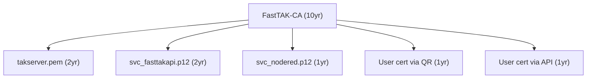
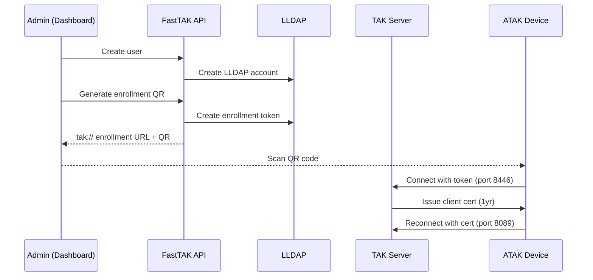
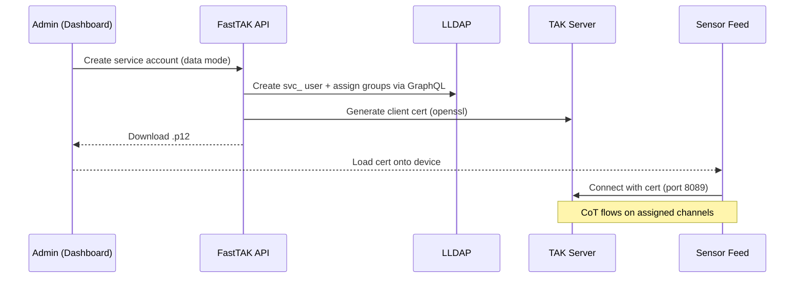

# FastTAK Certificate Guide

## The Big Picture

TAK doesn't use passwords to connect devices. Instead, every device gets a **certificate file** (`.p12`) that acts like a digital ID badge. When your phone (running ATAK or iTAK) connects to TAK Server, both sides show their ID badges to each other and verify they were issued by the same authority. If the badges check out, the connection is established.

This is called **mutual TLS (mTLS)** — both the server and the client prove their identity. It's more secure than passwords because there's nothing to guess, phish, or brute-force. And it works offline — once a device has its cert, it can connect without needing to reach an authentication server. The cert _is_ the credential.

### What's in a .p12 file?

A `.p12` file is a bundle containing:

- The device's identity certificate (who they are)
- The device's private key (proves they own the certificate)
- The CA certificate chain (so the device knows who to trust)

All protected by an import password (`atakatak`) that prevents accidental installation — see [The .p12 Password](#the-p12-password) below. The security comes from the certificate and private key inside, not the import password.

## Users, Service Accounts, and Certificates

These are three separate concepts. Getting them confused leads to operational mistakes.

### Users

**Users are people.** They generally authenticate via QR enrollment, and use ATAK, iTAK, or WinTAK. A user's identity follows the person — if they hand their device to someone else, the cert should be revoked and the new person should get their own.

### Service Accounts

**Service accounts are machines.** They are prefixed `svc_` and authenticate exclusively via client certificate. The identity is tied to the device or integration, not a person. If a device is handed to someone else, the cert stays on it.

Service accounts have two modes:

- **Data mode** — sends and receives CoT. Requires channel group assignments to control what data flows where. Examples: a UAS ground control station, a sensor feed, or a feed from an ADS-B provider to a channel.
- **Admin mode** — management API access. Gets `certmod -A` for `ROLE_ADMIN`. Example: `svc_fasttakapi` (the FastTAK API itself) or a Node-RED flow that requires admin access to manage users.

### Certificates

**Certificates are credentials, not identities.** A user or service account can have multiple certs — phone + tablet, old + new during rotation, or a replacement after a lost device. When a certificate is revoked, the account is not deleted; it just invalidates that one credential to preserve audit trails.

Same CN on multiple certs → same LDAP lookup → same groups and permissions.

### The "stays or goes" test

When deciding whether something should be a user or a service account, ask: **if the device is handed to someone else, does the cert stay or go?**

- **Stays** → service account. The identity is the machine (e.g., a UAS ground station, a sensor feed, a Node-RED integration).
- **Goes** → user account. The identity is the person (e.g., a pilot who carries their own laptop, a team leader with their phone).

## How FastTAK Manages Certificates

FastTAK uses a **single self-signed certificate authority** called `FastTAK-CA`. The files `root-ca.pem` and `ca.pem` are identical copies of this CA certificate. The CA is created once at bootstrap and signs everything: server certs, user certs, and service account certs.

### Trust chain



## Certificate Validity

| Cert type               | Validity        | Generated by                                                   |
| ----------------------- | --------------- | -------------------------------------------------------------- |
| CA                      | 10 years        | `makeRootCa.sh` (bootstrap)                                    |
| Server                  | 2 years         | `makeCert.sh` (bootstrap)                                      |
| User (QR enrollment)    | 1 year          | TAK Server `ca-signing.jks` (`validityDays=365` in CoreConfig) |
| User (manual)           | 1 year          | API (openssl direct)                                           |
| Service account (data)  | 1 year default  | API (openssl direct, configurable)                             |
| Service account (admin) | 2 years default | API (openssl direct, configurable)                             |

## Getting a Cert onto a Device

### QR Code enrollment (recommended)

The QR flow is the standard path for users with ATAK, iTAK, or WinTAK.



The device receives a 1-year client cert signed by the CA. No file transfers, no passwords to communicate.

### Manual download

For headless devices or situations where QR scanning isn't practical, download the `.p12` from the dashboard. The password is `atakatak` (see [DD-025](decisions.md#dd-025-keep-default-p12-password-atakatak)). Transfer the file to the device and import it into the TAK client.

## Service Account Modes

### Data mode

Data-mode service accounts send and receive CoT on assigned channels. They need channel group assignments to control data flow.



### Admin mode

Admin-mode service accounts get `certmod -A` on their certificate, granting `ROLE_ADMIN`. Create admin service accounts through the dashboard or API — they handle `certmod -A` registration automatically.

Example: `svc_fasttakapi` connects to TAK Server's admin API over the Docker network.

## Two Separate Certificate Systems

FastTAK runs **two independent certificate systems** that don't interact:

| System         | What it secures                         | Who manages it                       | Where                    |
| -------------- | --------------------------------------- | ------------------------------------ | ------------------------ |
| **Caddy TLS**  | Web browser HTTPS (admin UI, portal)    | Automatic — Caddy handles everything | Caddy's internal storage |
| **TAK Server CA** | Device connections (ATAK, iTAK, WinTAK) | You, via dashboard or `./certs.sh`   | `./tak/certs/files/`     |

In **subdomain mode**, Caddy obtains trusted certificates from Let's Encrypt (ACME). In **direct mode**, Caddy generates self-signed certificates using its built-in internal CA — browsers will show a certificate warning on first visit (see [Self-signed certificate warnings](#self-signed-certificate-warnings) below).

When you visit the web UI in a browser, that's a Caddy-managed cert. When ATAK connects to port 8089, that's a TAK CA cert. Completely separate trust chains.

### Self-signed certificate warnings

In direct mode (`DEPLOY_MODE=direct`), browsers show a self-signed warning on first visit to each service port. Accept the warning to proceed. To suppress warnings permanently, install Caddy's root CA certificate as a trusted root on your devices. The CA cert is stored in the `caddy-data` Docker volume at `pki/authorities/local/root.crt`.

## Changing Server Address

When switching `SERVER_ADDRESS` (e.g., from an IP to an FQDN), the **TAK server cert** must be regenerated because it contains the address as a SAN. **Client certs are unaffected** — they're signed by the CA and don't contain the server's address. Enrolled devices keep working; they just need to point at the new address.

What to do:
1. Update `SERVER_ADDRESS` (and optionally `DEPLOY_MODE`) in `.env`
2. Delete the old server cert: `rm tak/certs/files/takserver.{jks,pem,p12}`
3. Delete the old address-specific cert: `rm tak/certs/files/${old_address}.*`
4. Restart — `init-config` regenerates the server cert and Caddyfile, Caddy gets fresh TLS certs

The CA, client certs, and `ca-signing.jks` are all preserved. No re-enrollment needed.

## Key Files

All cert files live at `./tak/certs/files/` on the host (bind-mounted into containers). They survive `docker compose down` — only `down -v` with a manual `rm -rf tak/` removes them.

| File                                                | What it is                                         |
| --------------------------------------------------- | -------------------------------------------------- |
| `root-ca.pem` / `ca.pem`                            | CA public cert (identical files, same fingerprint) |
| `root-ca-do-not-share.key` / `ca-do-not-share.key`  | CA private key — **PROTECT THIS**                  |
| `root-ca-trusted.pem`                               | Trusted CA bundle                                  |
| `ca-signing.jks`                                    | CA keystore used for QR enrollment cert signing    |
| `takserver.pem` / `takserver.p12` / `takserver.jks` | Server cert (various formats)                      |
| `truststore-root.jks`                               | Trusted CA store for verification                  |
| `svc_fasttakapi.p12`                                | API service cert (admin mode)                      |
| `svc_nodered.p12`                                   | Node-RED service cert (data mode)                  |
| `<name>.p12`                                        | Per-user/device client cert                        |

## The .p12 Password

All `.p12` files use the password `atakatak`. This is a universal TAK ecosystem convention, not a secret. Every TAK tool, tutorial, and client application assumes this password. The password protects the file at rest (prevents accidental import) — the real security is that the cert must be signed by the deployment's CA.

See [DD-025](decisions.md#dd-025-keep-default-p12-password-atakatak) for the full rationale.

## Common Tasks

### Check CA expiry

```bash
./certs.sh ca-info
```

FastTAK's healthcheck monitors cert expiry — TAK Server becomes `unhealthy` when any cert is within 30 days of expiring.

### Revoke a cert

```bash
./certs.sh revoke alice
```

### List all certs

```bash
./certs.sh list
```

### Full command reference

```bash
./certs.sh help
```

> **Note:** Client cert creation is handled through the dashboard (QR enrollment or manual download), not via `certs.sh` directly.

## Server Cert Rotation

The server cert expires every **2 years**. Rotation requires:

1. Generate a new server cert signed by the same CA
2. Restart TAK Server
3. Clients are **unaffected** — they trust the CA, not the specific server cert

This is tracked as [GitHub issue #23](https://github.com/orgs/your-org/issues/23). Consider automating this before the first expiry.

## What to Protect

**CA private keys** (`root-ca-do-not-share.key` / `ca-do-not-share.key`) are the crown jewels. Anyone with these files can issue certs that TAK Server will trust. The `./tak/certs/files/` directory should have restricted permissions in production.

**`.p12` files** are user/service credentials. Distribute them securely — they grant access to your TAK network.

**`ca-signing.jks`** contains the CA's signing key in Java KeyStore format. TAK Server uses it to issue certs during QR enrollment.

## Compatibility Notes

FastTAK checks all `.p12` files on startup and re-exports any using legacy ciphers with modern AES-256-CBC encryption. TAK Server's upstream cert tools use RC2-40 which modern OpenSSL 3.x rejects — FastTAK handles this transparently so certs work with CloudTAK, modern Linux, and any other OpenSSL 3.x tool out of the box.
